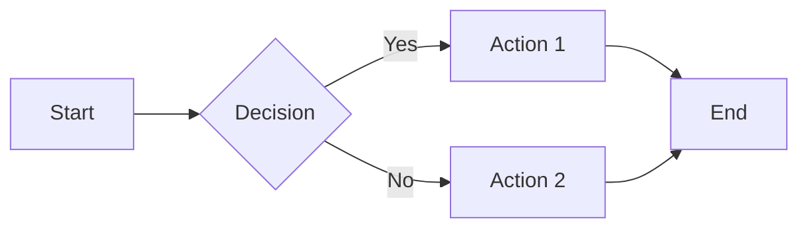
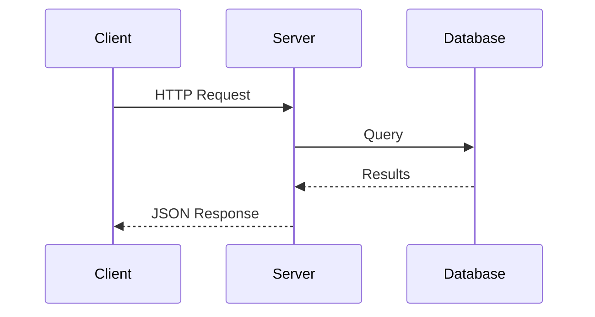
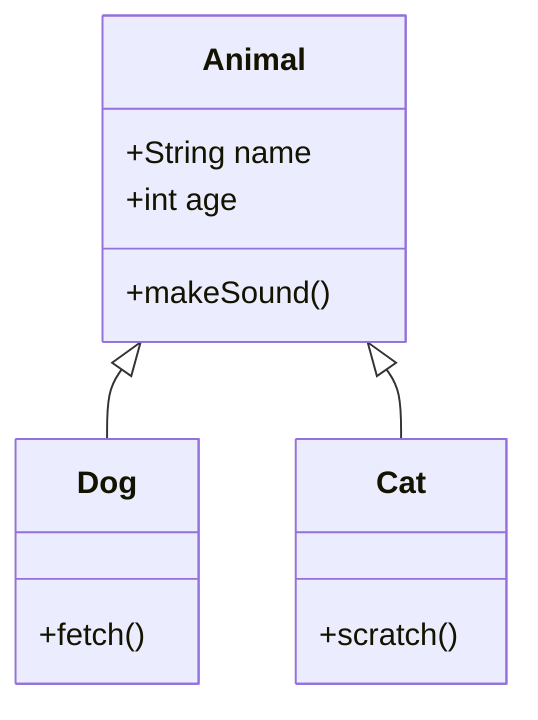

# Markdown Demo

This page demonstrates Markdown syntax supported by the docs viewer.

## Source vs. Rendered

Below each example you'll see the raw Markdown source in a code block.

---

## Headings

Use `#` for headings (1-6 levels).

```markdown
# Heading 1
## Heading 2
### Heading 3
```

---

## Text Formatting

**Bold text** and *italic text* and `inline code`.

```markdown
**Bold text** and *italic text* and `inline code`.
```

---

## Lists

### Unordered List

- First item
- Second item
  - Nested item
  - Another nested
- Third item

```markdown
- First item
- Second item
  - Nested item
  - Another nested
- Third item
```

### Ordered List

1. Step one
2. Step two
3. Step three

```markdown
1. Step one
2. Step two
3. Step three
```

---

## Links

Visit the [Overview](../index.md) page for navigation.

External link: [GitHub](https://github.com)

```markdown
Visit the [Overview](../index.md) page for navigation.

External link: [GitHub](https://github.com)
```

---

## Images


```markdown

```

*Note: Place images in `docs/assets/` and use relative paths from your markdown file.*

---

## Code Blocks

```python
def hello(name):
    """Greet someone."""
    return f"Hello, {name}!"

print(hello("World"))
```

~~~markdown
```python
def hello(name):
    """Greet someone."""
    return f"Hello, {name}!"

print(hello("World"))
```
~~~

---

## Tables

| Feature | Status | Notes |
|---------|--------|-------|
| Markdown | Done | Full support |
| Mermaid | Done | Diagrams |
| Images | Done | Relative paths |

```markdown
| Feature | Status | Notes |
|---------|--------|-------|
| Markdown | Done | Full support |
| Mermaid | Done | Diagrams |
| Images | Done | Relative paths |
```

---

## Blockquotes

> This is a blockquote.
> It can span multiple lines.
>
> And have multiple paragraphs.

```markdown
> This is a blockquote.
> It can span multiple lines.
>
> And have multiple paragraphs.
```

---

## Horizontal Rule

Use `---` to create a horizontal line:

---

```markdown
---
```

---

## Mermaid Diagrams

Mermaid lets you create diagrams from text.

### Flowchart



~~~markdown

~~~

### Sequence Diagram



~~~markdown

~~~

### Class Diagram



~~~markdown

~~~

---

## Summary

This demo shows the key Markdown features:

- **Text**: Headings, bold, italic, code
- **Structure**: Lists, tables, blockquotes
- **Media**: Images, links
- **Code**: Syntax-highlighted blocks
- **Diagrams**: Mermaid flowcharts, sequences, classes

All rendered by [marked.js](https://marked.js.org/) with [Mermaid](https://mermaid.js.org/).
